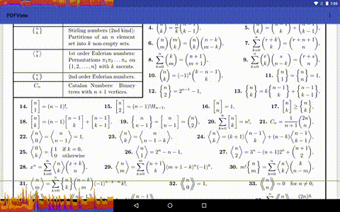
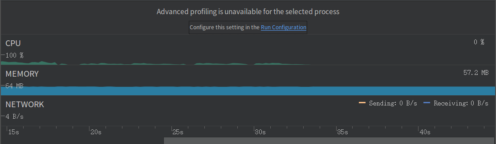

# Android PDF View

Library for displaying PDF documents on Android, inspired by the awsome project [AndroidPdfViewer](https://github.com/barteksc/AndroidPdfViewer). It use [PdfiumAndroid](https://github.com/barteksc/PdfiumAndroid) to decod and render PDF files.

# Why another wheel?

A good reason is I need a more efficient and more configurable PDF rendering library to display PDF documents. There are some advantages of this library:

- Memory reuse and no memory jitter. This library will recycle the bitmaps that no longer visible and reuse it, that avoid memory recycle and reallocate.

- Very efficient. No frames lose any more when scrolling.

- Easy to config and extend.

A picture is worth a thousand words:



*Rendering performance*



*Memory usage*

# Installation

Library is available in jcenter repository, add this script to your build.gradle file to install:

```gradle
compile 'io.ea:pdfview:1.1.0'
```

# ProGuard

Add following rule to your proguard config file:

```
-keep class com.shockwave.**
```

# How to use

First include `PDFView` to your layout:

```xml
<io.ea.documentview.pdf.PDFView
    andorid:id="@+id/pdf"
    android:layout_width="match_parent"
    android:layout_height="match_parent"/>
```

Alternatively, you could use the `WritablePDFView` that allows you to handwrite.

And then, load a PDF document:

```kotlin
findViewById<WritablePDFView>(R.id.pdf).apply {
    adapterConfig = DefaultAdapterConfig(dp(18))
    pageBackground = resources.getDrawable(R.drawable.bg_page)
    handWriting.writingColor = Color.RED
    onSingleTab = { Log.i(TAG, "onSingleTab") }
    scrollListener = object : DocumentView.ScrollListener {

        override fun onScrolled(view: DocumentView, dx: Int, dy: Int) {
            Log.i(TAG, "onScrolled, [$dx, $dy]")
        }

        override fun onScrollSateChanged(view: DocumentView, oldState: Int, newState: Int) {
            Log.i(TAG, "onScrollStateChanged, $oldState -> $newState")
        }
    }
    zoomListener = object : DocumentView.ZoomListener {

        override fun onZoomStart(view: DocumentView) {
            Log.d(TAG, "onZoomStart")
        }

        override fun onZoomed(view: DocumentView, deltaScale: Float, px: Float, py: Float) {
            Log.i(TAG, "onZoomed, to [$deltaScale, $px, $py]")
        }

        override fun onZoomEnd(view: DocumentView) {
            Log.e(TAG, "onZoomEnd")
        }
    }
    stateListener = object : BitmapDocumentView.StateListener {

        override fun onLoading(view: BitmapDocumentView) {
            Log.i(TAG, "onLoading")
        }

        override fun onLoaded(view: BitmapDocumentView) {
            Log.i(TAG, "onLoaded")
        }

        override fun onLoadError(view: BitmapDocumentView, cause: Throwable) {
            Log.e(TAG, "onLoadError", cause)
        }

        override fun onRenderingError(page: Int, view: BitmapDocumentView, cause: Throwable) {
            Log.e(TAG, "onRenderingError", cause)
        }
    }
    load(FileSource(File("/sdcard/test_pdf.pdf")))
}
```

Very simple. For more details, please check out the samples of this project.

# License

This project is under the [Apache-2.0](http://www.apache.org/licenses/LICENSE-2.0)

```
Copyright 2018 Nano Michael

Licensed under the Apache License, Version 2.0 (the "License");
you may not use this file except in compliance with the License.
You may obtain a copy of the License at

    http://www.apache.org/licenses/LICENSE-2.0

Unless required by applicable law or agreed to in writing, software
distributed under the License is distributed on an "AS IS" BASIS,
WITHOUT WARRANTIES OR CONDITIONS OF ANY KIND, either express or implied.
See the License for the specific language governing permissions and
limitations under the License.
```
